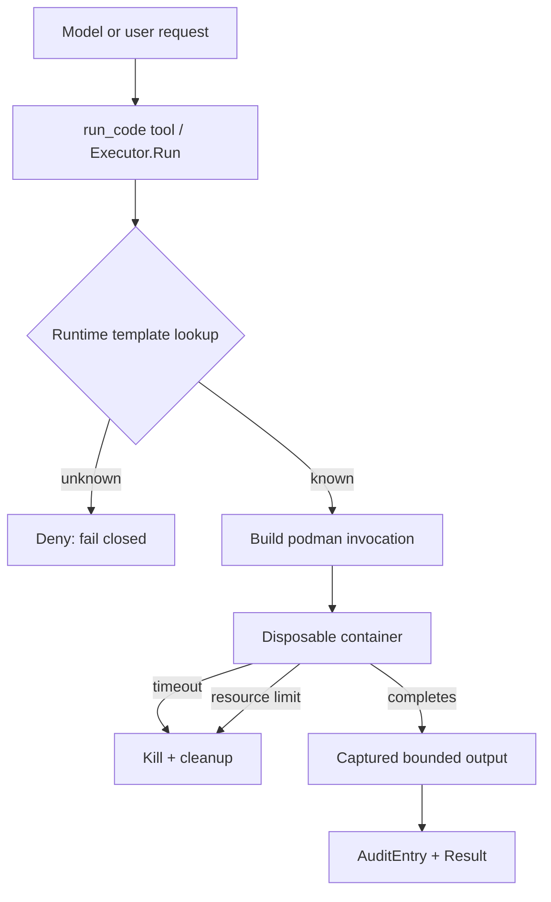

# Code Execution Sandbox Design

**Status:** proposed

## Goal

Provide Agent-facing execution of untrusted code and shell commands with
strong, language-agnostic isolation. Each invocation runs in a disposable
sandbox: bounded time, bounded resources, no network by default, no host
filesystem access beyond an explicit workspace, and no retained state.

## Non-goals

- This is not a file-I/O sandbox. Path confinement inside the workspace is
  provided by the existing `file.Sandbox` / `filegen` components.
- E2B Cloud is an implemented remote microVM provider. E2B self-hosted,
  Firecracker, and Kata orchestration remain out of scope for this component.
- No multi-tenant scheduling platform. Quotas and audit are per-service
  configuration, not a control plane.

## Threat model

The `code` / `args` payload is fully untrusted. It may attempt: filesystem
destruction (`rm -rf /`), reading host secrets (`/etc/shadow`, env, docker
socket), network exfiltration or reverse shells, resource exhaustion
(fork bomb, memory blowup), long-running or infinite loops, and host-kernel
exploitation after container escape. The image, provider binary (podman),
and executor configuration are trusted inputs.

## Architecture



### Executor interface

```go
type Executor interface {
    Run(ctx context.Context, spec Spec) (Result, error)
    Close() error
}

type Spec struct {
    Runtime      string            // template name: python, node, shell, ...
    Code         string            // code or shell command
    Args         []string          // argv, never through a shell
    Stdin        []byte
    Timeout      time.Duration     // hard deadline; kill on expiry
    MemoryLimit  int64             // bytes, cgroups --memory
    PidLimit     int64             // --pids-limit, fork-bomb guard
    Network      NetworkPolicy     // none (default) | dns | host-proxy
    Workspace    string            // host dir mounted read-write (optional)
    ReadOnlyRoot bool              // default true
    Env          []string          // explicit allowlist, no secrets
    OutputLimit  int64             // captured stdout/stderr cap
}

type Result struct {
    ExitCode int
    Stdout   string
    Stderr   string
    Duration time.Duration
}
```

### Provider selection

Probe order at construction, overridable by config:

```
auto    → podman → docker → error   // local-only probe; never incurs Cloud cost
e2b     → explicit E2B Cloud provider, API key and template ID required
local   → explicit dev-only backend (UNSANDBOXED warning)
none    → NewExecutor fails; caller must not fall back to bare exec.Command
```

### Podman invocation template

Every run is a fresh, disposable container. Parameters are fixed policy,
not caller-tunable:

```
podman run --rm
  --network none                 # no exfiltration, no reverse shell
  --cap-drop ALL                 # no privilege escalation
  --security-opt no-new-privileges
  --pids-limit <PidLimit>        # fork-bomb guard
  --memory <MemoryLimit>
  --memory-swap <MemoryLimit>    # no swap escape
  --read-only                    # immutable rootfs
  --tmpfs /tmp:rw,size=64m
  --env <ALLOWLIST...>
  [--volume <Workspace>:/workspace:rw]   # only explicit workspace
  --cidfile <tmp>                # reliable cleanup handle
  --name <run-<id>>
  <image> <entrypoint> <code/args>
```

- Never `podman exec` into a shared container; state cannot leak between runs.
- No `--privileged`, no `--device`, no docker socket mounts, no host `--pid`.
- Timeout enforced twice: `context` deadline kills via `podman kill`, then
  `podman rm -f` with the recorded cidfile as cleanup.
- Output read from stdout/stderr pipes with `io.LimitReader(OutputLimit)`.

### Runtime templates (language-agnostic)

One base image `agent-runner:<tag>` (deterministic tag, never `latest`),
pre-installed runtimes and tools. Runtime → entrypoint mapping:

| Runtime | Entrypoint | Notes |
|---|---|---|
| python | `python3 -` (stdin) or `python3 <file>` | pip deps baked at image build |
| node | `node -e <code>` / `node <file>` | |
| shell | `/bin/bash -c <code>` | last resort, still confined |
| go / rust / cc | compile inside container, then run | toolchain in image |
| custom | configured image + entrypoint | enterprise templates |

Templates are the only surface that grows with language demand; the sandbox
core stays language-agnostic.

## Security model

- **Fail closed:** unknown runtime, missing provider, or invalid spec → deny.
- **No network by default**; verified by test (`curl` inside sandbox must fail).
- **No host state:** `--rm`, fresh container, workspace only if explicitly
  granted; nothing else is mounted.
- **Resource bounds:** memory + pids + timeout + output cap.
- **Least privilege:** `--cap-drop ALL`, no-new-privileges, read-only rootfs.
- **Audit:** every Run records runtime, duration, exit code, output size
  (never full untrusted output in logs beyond cap).
- **Rootless note:** rootless podman confines a container escape to the
  unprivileged user via userns remapping; preferred over rootful docker when
  the host lacks root.
- **E2B Cloud:** the provider creates a fresh secure E2B sandbox with
  `allow_internet_access: false`, uploads code as a temporary file, uses a
  short-lived sandbox access token for the process API, and deletes the
  sandbox after every run. E2B template configuration owns VM-level limits;
  the adapter adds per-process `ulimit` memory and PID ceilings.

## Deployment prerequisites

- Local provider: `podman` (rootless preferred) or `docker` binary; rootless
  userns availability check: `unshare -Ur true` must succeed.
- Local provider: base image built and pinned in CI; image signature/scan
  policy per enterprise setup.
- E2B provider: `E2B_API_KEY` (or `E2BConfig.APIKey`) and an E2B template ID.
  `Backend: "e2b"` is required; `auto` never spends Cloud quota implicitly.

## Testing strategy

- Unit: spec validation, template mapping, provider probe order.
- Integration (skip if no podman): each of the following must fail or be
  bounded — `rm -rf /`, read `/etc/shadow`, `curl evil.example`, fork bomb,
  memory blowup, infinite loop (timeout), output flood (output cap).
- E2B provider unit tests use an HTTP server to verify secure sandbox
  creation, offline policy, Connect process framing, payload upload, output
  decoding, exit status, and unconditional deletion. A real Cloud test must
  be explicitly enabled by the operator because it consumes quota.
- `make test` runs unit suite; integration gated behind build tag or env var.

## Future work

- E2B self-hosted / BYOC deployment behind the existing E2B provider config.
- gVisor (`runsc`) as an OCI runtime for stronger syscall isolation.
- WASM provider for zero-dependency offline execution if a template
  requirement emerges.
